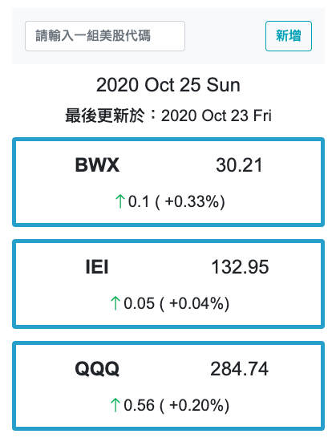

  

<h4 align="center"> Stock Price Dashboard - Google 擴充套件 </h3>
<h5 align="center"> Stock Price Dashboard - Google Extension</h3>
<a target="_blank" href="#">
  
Click here to download page

</a>

## Table of Contents

-   [About this project](#about-this-project)
-   [How to use](#how-to-use)

## About this project

This extension is utilized to assist users to get the latest US stock price.

使用者可以藉此取得最近一個工作日的美國股市價格。

## How to use

**Content內容**

Please click the icon, and the requested data will show after a few moments. You can also add your favorite stock symbols.

簡單的點一下按鈕，右上角的彈出視窗就會出現資料了。最多可以顯示五筆資料。

  

## Author

-   [Andy Lien](https://github.com/andy922200)

## Icon Credit

<h6>Icon made by <a href="https://www.flaticon.com/authors/freepik" target="_blank">Freepik</a> from 
<a href="https://www.flaticon.com/" target="_blank" rel="noopener noreferrer">https://www.flaticon.com/</h6>
